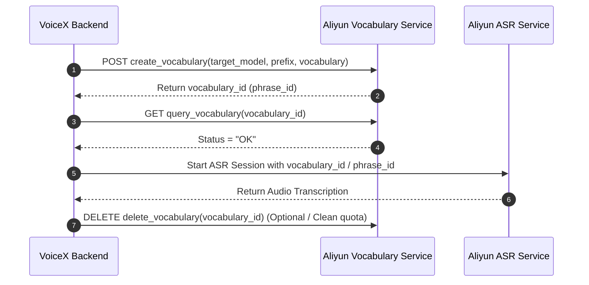
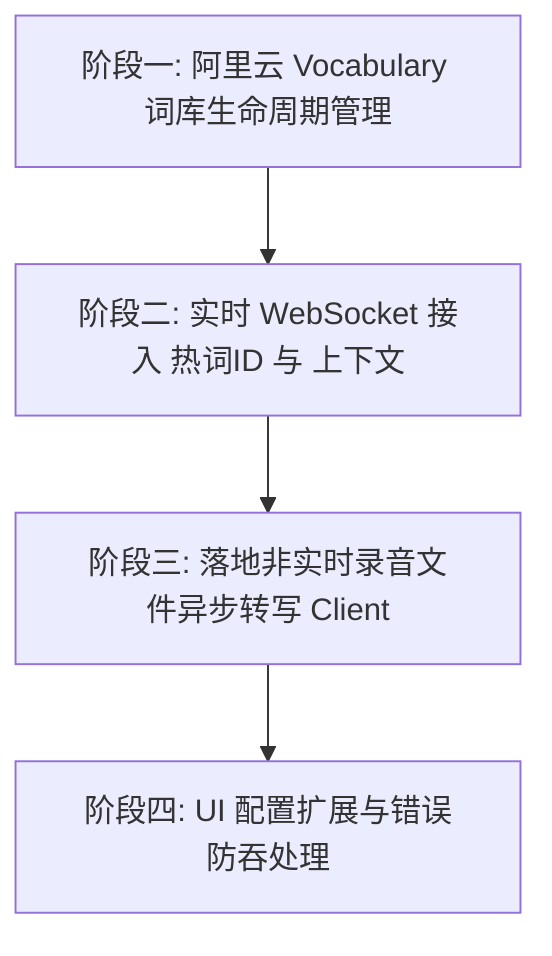

# 阿里云百炼 ASR 完整技术与开发指导文档

> **文档状态**：建议方案 / 待开发落地  
> **适用范围**：VoiceX 语音识别能力升级（实时模式优化、非实时录音识别落地、热词/上下文增强准确率提升）

---

## 1. 概述与核心目标

VoiceX 目前仅实现了阿里云/通义 ASR 的**实时 WebSocket 模式**，且在使用热词词库时采用的是拼装 Prompt 的软提示（Soft Prompt）兜底方案，未充分发挥阿里云百炼（Model Studio / DashScope）原生的 **自定义热词（Vocabulary API）**、**上下文增强（Context Enhancement）** 以及 **非实时录音文件识别（Async File Transcription）** 能力。

为了全面提升 VoiceX 在专业术语识别、长录音文件转写、转写准确率以及多轮语音交互上的表现，本文档深入整理了阿里云官方最新的技术文档，并制定了下一步开发落地的具体方案。

---

## 2. 阿里云 ASR 模型矩阵与模式对比

阿里云百炼语音识别分为 **实时语音识别** 与 **非实时语音识别** 两大类模式，涵盖 Fun-ASR、Qwen-ASR 及 Paraformer 三大模型家族。

> **重要**：以下矩阵据阿里云官方文档（更新于 2026-07-22）校正。Fun-ASR 的"自定义热词"与"上下文增强"是**两套独立机制**，支持的模型集合不同——这是模型选型最易踩坑的地方。详见 [§2.2](#22-fun-asr-模型--能力矩阵官方校正)。

### 2.1 模式选型矩阵

| 模式类型 | 代表模型 | 适用场景 | 交互协议 | 识别时延 | 准确率优化手段支持 |
| :--- | :--- | :--- | :--- | :--- | :--- |
| **实时语音识别** | `fun-asr-realtime`<br>`qwen3-asr-flash-realtime`<br>`paraformer-realtime-v2` | 边说边出字、实时对话、实时字幕、语音输入法 | WebSocket 双工流式 | 极低（几十~几百 ms） | **自定义热词** (Fun/Paraformer)<br>**上下文增强** (仅部分 Fun-ASR 快照) |
| **非实时异步识别** | `fun-asr`<br>`qwen3-asr-flash-filetrans`<br>`paraformer-v2` | 录音文件转写、会议纪要、长音频分析（最长12小时/2GB） | HTTP RESTful 异步任务 (POST + GET 轮询/回调)，**需公网 file_url** | 异步离线处理 | **自定义热词** (Fun/Paraformer)<br>说话人分离 / 句词级时间戳 |
| **非实时同步识别** | `fun-asr-flash-2026-06-15`<br>`qwen3-asr-flash` | 短录音文件（< 5分钟）快速转写 | HTTP POST 同步 (Multimodal Generation)，**可 Base64** | 低（秒级） | **上下文增强** (仅 fun-asr-flash-2026-06-15) |

### 2.2 Fun-ASR 模型 × 能力矩阵（官方校正）

官方"自定义热词"与"上下文增强"的适用模型列表不同，且随快照版本变化。下表是 VoiceX 选型时的权威依据：

| 模型 | 模式 | 自定义热词 | 上下文增强 | 备注 |
| :--- | :--- | :--- | :--- | :--- |
| `fun-asr-realtime` | 实时 WS | ✅ | ✅ | 稳定版，VoiceX UI 当前默认；两种增强都支持 |
| `fun-asr-realtime-2026-02-28` | 实时 WS | ✅ | ❌ | 最新快照，**不支持上下文增强**——开了会被静默忽略 |
| `fun-asr-realtime-2025-11-07` | 实时 WS | ✅ | ✅ | 两种增强都支持 |
| `fun-asr-realtime-2025-09-15` | 实时 WS | ✅ | ❌ | 旧快照 |
| `fun-asr-flash-8k-realtime` | 实时 WS 8k | ✅ | ❌ | 8k 采样率专用 |
| `fun-asr-flash-8k-realtime-2026-01-28` | 实时 WS 8k | ✅ | ❌ | 8k 快照 |
| `fun-asr` | 非实时异步 | ✅ | ❌ | 需公网 file_url，≤12h/2GB |
| `fun-asr-2025-11-07` / `fun-asr-2025-08-25` | 非实时异步 | ✅ | ❌ | 异步快照 |
| `fun-asr-mtl` / `fun-asr-mtl-2025-08-25` | 非实时异步 | ✅ | ❌ | 多语种（mtl）变体 |
| `fun-asr-flash-2026-06-15` | 非实时同步 | ❌ | ✅ | Multimodal Generation 端点，可 Base64，<5min；**不支持自定义热词** |

**选型踩坑提示（VoiceX 实现时必须处理）**：

1. **最新快照 ≠ 能力最全**：`fun-asr-realtime-2026-02-28` 支持热词但**不支持**上下文增强。若 UI 允许选最新快照又开上下文，必须显式提示，不能静默忽略。
2. **热词 `target_model` 严格匹配**：创建词表时声明的 `target_model` 必须与识别时传入的 `model` 完全一致，否则热词不报错但不生效。词表生命周期要按模型维度管理。
3. **非实时异步必须公网 file_url**：VoiceX 录音为本地文件，走 `fun-asr` 异步模式需要先上传 OSS 或起本地签名 HTTP 服务——这是异步模式落地的主要障碍。同步模式 `fun-asr-flash-2026-06-15` 可走 Base64，落地成本低。
4. **新加坡地域的"子业务空间"不支持热词**（主业务空间支持）。当前 VoiceX UI 提供新加坡端点选项，开启热词时需配合提示。

---

## 3. 准确率提升方案一：自定义热词 (Custom Hotwords)

### 3.1 工作原理与限制

自定义热词在模型解码阶段通过提供带权重的词汇表提升目标词汇的匹配概率，适合**词汇已知且固定**的场景（如人名、公司名、产品术语、医学/法学术语）。

* **免费配额与限制**：
  * **热词列表数量**：每个阿里云账号最多创建 **10 个** 热词列表（所有模型共享）。
  * **单个列表热词数**：上限 **500 个** 热词。
  * **地域限制**：新加坡地域的**子业务空间**暂不支持热词；新加坡**主业务空间**与华北2（北京）均支持（但两地 API Key 不同，且支持的模型快照集合略有差异，详见 [§2.2](#22-fun-asr-模型--能力矩阵官方校正)）。
* **热词文本规范**：
  * **含中文/非 ASCII 字符**：总字符数不超过 **15 个**字符（例：`"EGFR抑制剂"` 为 7 字符）。
  * **纯 ASCII（英文）**：按空格切分后的片段数不超过 **7 个**单词（例：`"Human immunodeficiency virus type 1"` 为 5 片段）。
* **权重设置建议**：
  * `1~2`：轻微偏好（与常用词同音，防止误发音纠偏过度）。
  * `3~4`：**推荐起始值（建议默认为 4）**。
  * `5`：强制偏好（频繁出现且不易与其他词混淆；过高可能导致误识别）。

### 3.2 热词 API 生命流程 (Lifecycle)

创建热词列表时必须绑定 **`target_model`**，且调用 ASR 识别时传入的 `model` 必须与创建时指定的 `target_model` 严格一致，否则热词不会生效（接口不报错但静默失效）。



### 3.3 热词 JSON 结构体定义

```json
[
  {"text": "VoiceX", "weight": 4, "lang": "zh"},
  {"text": "Antigravity", "weight": 4, "lang": "en"},
  {"text": "赛德克巴莱", "weight": 4, "lang": "zh"}
]
```

### 3.4 各模式下的热词传参方式

1. **实时 ASR (WebSocket `fun-asr-realtime` / `paraformer-realtime-v2`)**：
   在 WebSocket `run-task` 的 `payload.parameters` 中传入 `vocabulary_id`：
   ```json
   {
       "header": {
           "action": "run-task",
           "task_id": "uuid-xxx",
           "streaming": "duplex"
       },
       "payload": {
           "task_group": "audio",
           "task": "asr",
           "function": "recognition",
           "model": "fun-asr-realtime",
           "parameters": {
               "format": "pcm",
               "sample_rate": 16000,
               "vocabulary_id": "voca-xxxxxx"
           }
       }
   }
   ```
2. **非实时 ASR (HTTP Async `fun-asr` / `paraformer-v2`)**：
   在 POST 请求的 `parameters` 中传入 `vocabulary_id`：
   ```json
   {
       "model": "fun-asr",
       "input": {
           "file_urls": ["https://your-domain.com/audio.wav"]
       },
       "parameters": {
           "vocabulary_id": "voca-xxxxxx"
       }
   }
   ```

---

## 4. 准确率提升方案二：上下文增强 (Context Enhancement)

### 4.1 工作原理与适用模型

上下文增强在识别时传入**前几轮对话历史**或**领域术语文本**，利用大语言/语音多模态模型的上下文理解能力动态修正识别结果。适合动态变化的词汇或多轮语音对话。

* **支持模型**：
  * **实时模式**：`fun-asr-realtime`、`fun-asr-realtime-2025-11-07`
  * **非实时模式**：`fun-asr-flash-2026-06-15`
* **硬性约束与边界**：
  * **消息轮数限制**：引擎最多保留最近 **5 轮** 上下文内容。
  * **文本长度限制**：每轮上下文总长度不超过 **400 个字符**（含字母、汉字、标点与空格），超出部分从末尾截断。
  * **词表匹配机制**：`text` 字段中必须包含音频里可能出现的**待识别原词**（如 `"Kubernetes Istio Envoy"`），仅提供模糊描述效果有限。

### 4.2 传参规范

#### A. 实时 WebSocket 模式 (`fun-asr-realtime`)

在 WebSocket `run-task` 事件的 `payload.input.context` 中传入上下文：

```json
{
    "header": {
        "action": "run-task",
        "task_id": "2bf83b9a-xxxx-xxxx-xxxx-xxxxxxxxxxxx",
        "streaming": "duplex"
    },
    "payload": {
        "task_group": "audio",
        "task": "asr",
        "function": "recognition",
        "model": "fun-asr-realtime",
        "parameters": {
            "format": "pcm",
            "sample_rate": 16000
        },
        "input": {
            "context": [
                {
                    "role": "user",
                    "content": [
                        {
                            "type": "input_text",
                            "text": "VoiceX Rust Tauri WebSocket ASR"
                        }
                    ]
                },
                {
                    "role": "assistant",
                    "content": [
                        {
                            "type": "text",
                            "text": "好的，我已经准备好为您转写语音了。"
                        }
                    ]
                }
            ]
        }
    }
}
```
*注：如果在双工实时识别过程中需要动态更新上下文，可向 WebSocket 发送 `action: "continue-task"` 事件。*

#### B. 非实时同步模式 (`fun-asr-flash-2026-06-15`)

在 HTTP POST 的 `input.messages` 中将上下文消息置于 `input_audio` 之前：

```json
{
    "model": "fun-asr-flash-2026-06-15",
    "input": {
        "messages": [
            {
                "role": "user",
                "content": [
                    {
                        "type": "input_text",
                        "text": "专业词表：Kubernetes Istio Envoy sidecar proxy"
                    }
                ]
            },
            {
                "role": "user",
                "content": [
                    {
                        "type": "input_audio",
                        "input_audio": {
                            "data": "https://your-domain.com/audio.wav"
                        }
                    }
                ]
            }
        ]
    },
    "parameters": {
        "format": "wav",
        "sample_rate": "16000"
    }
}
```

---

## 5. 非实时/录音文件识别 (Non-realtime ASR) 接入规范

目前 VoiceX 在后处理/录音文件转写（Post-recording refine）时，对 Qwen 仅使用了 OpenAI-compatible chat completions 接口（Base64 上传短音频），受限于 10MB 负载且缺少专业的音视频文件解析能力。

引入阿里云百炼**非实时录音文件识别 API** 可以支持数小时的长音频文件转写、说话人分离及精确词级时间戳。

### 5.1 异步文件转写 (Async File Transcription)

#### 1. 提交转写任务 (POST)

* **URL**: `https://{WorkspaceId}.cn-beijing.maas.aliyuncs.com/api/v1/services/audio/asr/transcription`
* **Headers**:
  * `Authorization: Bearer $DASHSCOPE_API_KEY`
  * `Content-Type: application/json`
  * `X-DashScope-Async: enable` *(重要：必须开启异步头)*
* **Payload** (`fun-asr` / `qwen3-asr-flash-filetrans` / `paraformer-v2`):

```json
{
    "model": "qwen3-asr-flash-filetrans",
    "input": {
        "file_url": "https://your-oss-bucket.oss-cn-beijing.aliyuncs.com/meeting_record.mp3"
    },
    "parameters": {
        "channel_id": [0],
        "enable_itn": false,
        "enable_words": true
    }
}
```
*响应返回*: `{"output": {"task_id": "c345a32b-xxxx-xxxx-xxxx-xxxxxxxxxxxx", "task_status": "PENDING"}, "request_id": "..."}`

#### 2. 轮询任务状态 (GET)

* **URL**: `https://{WorkspaceId}.cn-beijing.maas.aliyuncs.com/api/v1/tasks/{task_id}`
* **Headers**:
  * `Authorization: Bearer $DASHSCOPE_API_KEY`
  * `X-DashScope-Async: enable`
* **响应格式** (`task_status` 为 `SUCCEEDED` 时):
  ```json
  {
      "request_id": "...",
      "output": {
          "task_id": "c345a32b-...",
          "task_status": "SUCCEEDED",
          "results": [
              {
                  "subtask_status": "SUCCEEDED",
                  "transcription_url": "https://dashscope-result-bj.oss-cn-beijing.aliyuncs.com/transcription/xxx.json"
              }
          ]
      }
  }
  ```

#### 3. 获取并解析识别 JSON (`transcription_url`)

`transcription_url` 为公网可直接下载的 JSON 文件，**有效期为 24 小时**。数据结构包含句子级与词级时间戳：

```json
{
    "file_url": "https://...",
    "properties": {
        "original_duration_in_milliseconds": 12500
    },
    "transcripts": [
        {
            "channel_id": 0,
            "text": "VoiceX 是一款极速跨平台语音助手。",
            "sentences": [
                {
                    "sentence_id": 1,
                    "begin_time": 500,
                    "end_time": 3200,
                    "text": "VoiceX 是一款极速跨平台语音助手。",
                    "words": [
                        { "begin_time": 500, "end_time": 900, "text": "VoiceX", "punctuation": "" },
                        { "begin_time": 900, "end_time": 1200, "text": "是一款", "punctuation": "" },
                        { "begin_time": 1200, "end_time": 1800, "text": "极速", "punctuation": "" },
                        { "begin_time": 1800, "end_time": 2500, "text": "跨平台", "punctuation": "" },
                        { "begin_time": 2500, "end_time": 3200, "text": "语音助手。", "punctuation": "。" }
                    ]
                }
            ]
        }
    ]
}
```

---

## 6. VoiceX 下一步开发落地 Roadmap

基于上述分析，为使 VoiceX 充分发挥阿里云百炼 ASR 的全量能力，建议实施以下 4 个阶段的开发动作：



### 6.0 Fun-ASR 专项推荐方案（分阶段，本期聚焦）

> 以下范围决策基于 [§2.2](#22-fun-asr-模型--能力矩阵官方校正) 的能力矩阵与当前 VoiceX 实现成本权衡。状态标注遵循 AGENTS.md：`建议方案` / `待确认` / `已实现但未验证` / `已完成`。

**本期范围（Fun-ASR 热词 + 非实时同步模式）—— 建议方案**

| # | 动作 | 方案 | 状态 | 依据 |
| :--- | :--- | :--- | :--- | :--- |
| F1 | 实时模式接入**上下文增强** | 在 `funasr_client.rs` 的 `run-task` 中填入 `payload.input.context`（`user`/`input_text`，词表来自 `config.hotwords`），复用 `qwen_client.rs` 已验证的 corpus 思路。删除"inline hotwords are not supported"日志。 | 建议方案 | 零云端资源、立即可用；仅对 `fun-asr-realtime`/`-2025-11-07` 生效，需在 UI 提示 |
| F2 | 新增**非实时同步 Client** `funasr_transcription_client.rs` | 走 `multimodal-generation` 端点 + Base64 音频，模型 `fun-asr-flash-2026-06-15`，<5min。复用 [qwen_transcription_client.rs](../src-tauri/src/asr/qwen_transcription_client.rs) 模式（注意响应结构不同：`output.output.sentence.text` / `output.text`，无 `choices`）。支持上下文增强。 | 建议方案 | 落地成本低，与现有 batch provider 一致；解决长录音受 Qwen 10MB 限制问题 |
| F3 | 能力声明与 pipeline 接线 | `AsrProviderCapabilities.FunAsr` 开启 `supports_batch` + `supports_post_recording_batch_refine`；`pipeline_mode()` 增加 FunAsr batch/realtime+final_pass 分支；`transcription.rs` 增加 `run_funasr_asr` 分发（参照 `run_qwen_asr`）。 | 建议方案 | 让 Fun-ASR 与 Qwen/ElevenLabs 一样支持实时+非实时两种模式 |
| F4 | UI 模型选项补全 + 能力标注 | [AsrFunAsrSettings.vue](../src/components/asr/AsrFunAsrSettings.vue) 模型下拉补全所有官方模型（含 8k/mtl/各快照），并用标签标注"支持热词/支持上下文增强"；当选中模型不支持已开启的增强时显式提示（不静默忽略）。 | 建议方案 | 解决"模型版本多、选择困难"，遵守 AGENTS.md 防静默失败规则 |

**下一期范围（暂不做，待本期验证效果后再定）—— 待确认**

| # | 动作 | 暂缓原因 |
| :--- | :--- | :--- |
| F5 | 实时模式接入**原生热词 Vocabulary API** | 需云端词表生命周期管理（10 个列表配额、`target_model` 绑定、按模型维度缓存/清理），工作量大。先用 F1 上下文增强验证"加字典是否有效"，效果再决定是否上原生 API |
| F6 | 非实时**异步**模式 `fun-asr`（长音频 ≤12h/2GB） | 必须公网 `file_url`，需先解决本地文件上传 OSS 或起本地签名 HTTP 服务的基础设施问题 |

**与现有"动作一~四"的对应关系**：F1 是动作二的子集（仅上下文增强部分），F2/F3 是动作三的子集（仅同步模式），F4 是动作四的子集。F5/F6 对应动作一与动作三的剩余部分。本专项不改变原 Roadmap，只是把 Fun-ASR 的落地拆成更小、可独立验证的增量。

### 动作一：实现阿里云 Vocabulary 词库生命周期管理模块 (Backend Rust)

1. **新建模块 `src-tauri/src/asr/aliyun_vocabulary.rs`**：
   - 提供 `create_vocabulary_if_needed(config: &AsrConfig, target_model: &str)` 函数。
   - 当用户在 VoiceX 中配置了自定义词库（`config.hotwords`）时，读取本地词库列表，将其格式化为 `{"text": "...", "weight": 4}` JSON 数组。
   - 调用阿里云 RESTful API `POST /api/v1/services/audio/asr/vocabulary` 创建云端热词表并返回 `vocabulary_id`。
   - 考虑到账号硬限制（上限 10 个词表），设计自动缓存/按需创建与清理解析机制。

### 动作二：升级现有的实时 WebSocket Client (`funasr_client.rs` & `qwen_client.rs`)

1. **`FunAsrRealtimeClient`**：
   - 将绑定的 `vocabulary_id` 填入 `run-task` 请求消息体的 `payload.parameters.vocabulary_id`。
   - 当开启 `enable_context` 且存在识别历史记录或配置词表时，填入 `payload.input.context`。
   - 删除代码中的 `"inline hotwords are not supported"` 日志限制。
2. **`QwenRealtimeClient`**：
   - 保持兼容层同时，支持在 `qwen3-asr-flash-realtime` 模式下正确格式化系统/上下文 Prompt。

### 动作三：新增非实时录音文件转写 Client (`aliyun_transcription_client.rs`)

1. **新建 `AliyunTranscriptionClient`**：
   - 支持异步模式 (`qwen3-asr-flash-filetrans` / `fun-asr`) 与同步模式 (`fun-asr-flash-2026-06-15`)。
   - 对于异步模式：处理音频文件上传（或利用内置本地 HTTP 服务器/签名 URL），发送 POST 请求，获取 `task_id`，使用 `tokio` 异步轮询任务状态，任务完成后下载 JSON 解析转写文本。
2. **集成到 `src-tauri/src/asr/transcription.rs`**：
   - 在 `run_qwen_asr` / `run_funasr_asr` 的 Batch / Post-recording refine 路径中接入新的 Client，彻底解决长音频文件限制问题。

### 动作四：前端配置与健全性处理 (UI & Robustness)

1. **设置页面增强 (`src/components/settings/`)**：
   - 在 ASR 设置页增加“阿里云模型增强配置”：
     - 热词默认权重设置 (1~5，默认 4)。
     - 上下文增强开关 (Context Enhancement)。
     - 非实时识别模型选择 (`fun-asr` / `qwen3-asr-flash-filetrans` / `fun-asr-flash-2026-06-15`)。
2. **遵守防静默失败规则 (`AGENTS.md`)**：
   - 当热词列表创建失败（如超过 10 个上限）或网络异常时，显示明确提示并记录日志，禁止静默吞掉失败，提供一键清理无效云端词表功能。

---

## 7. 参考链接与官方文档

- [阿里云实时语音识别用户指南](https://help.aliyun.com/zh/model-studio/real-time-speech-recognition-user-guide)
- [阿里云非实时语音识别用户指南](https://help.aliyun.com/zh/model-studio/non-realtime-speech-recognition-user-guide)
- [提升语音识别准确率（热词与上下文增强）](https://help.aliyun.com/zh/model-studio/improve-asr-accuracy)
